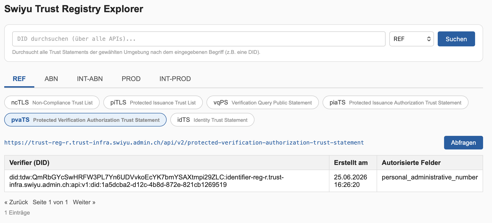

# Trust Registry Explorer

A lightweight PHP tool for browsing and searching the [swiyu](https://www.eid.admin.ch/) Trust Registry APIs across multiple environments — decodes the returned JWTs and displays their contents in readable, searchable tables.

> This project is fully developed and maintained with [Claude](https://claude.com) (Anthropic).

## Features

- **Multiple environments** — REF, ABN, PROD, INT-ABN, INT-PROD (easy to add more)
- **Six supported APIs** — `ncTLS`, `piTLS`, `vqPS`, `piaTS`, `pvaTS`, `idTS`
- **JWT decoding** (header + payload, no signature verification) with human-readable timestamps
- **Pagination and full-text search** — search automatically loads and searches across *all* pages of an API, not just the currently displayed one
- **Expandable row details** — click any row to see every field present in that entry's JWT; empty fields are explicitly marked as such, missing fields simply don't appear (so you can see at a glance which translations/attributes exist for a given entry)
- **Global DID search** — search a single DID across all six APIs at once and see every place it appears, with the entity name (from idTS) shown up front if available
- **Responsive UI** — full table on desktop, stacked card view on mobile, same underlying data and markup
- **Config-driven** — add a new environment or API by editing `config.php`, no other code changes needed

## Screenshot



## Requirements

- PHP 8.1 or newer
- PHP extensions: `curl`, `session`
- Outbound HTTPS access to the relevant `*.trust-infra.swiyu.admin.ch` (or `*.swiyu-int.admin.ch`) hosts

## Setup

1. Copy `config.php`, `functions.php`, and `index.php` into the same directory on your web server (or run locally, see below).
2. Point your web server's document root at that directory, or run it locally for a quick test:

   ```bash
   php -S localhost:8000
   ```

3. Open the page in a browser, pick an environment tab, then an API — that's it, no build step or dependencies to install.

## Configuration

Everything that can change — environments, APIs, their columns, and a few global settings — lives in `config.php`. No other file needs to be touched to extend the tool.

### Adding a new environment

```php
'environments' => [
    'REF' => ['label' => 'REF', 'base_url' => 'https://trust-reg-r.trust-infra.swiyu.admin.ch'],
    // add a new one the same way:
    'NEW-ENV' => ['label' => 'NEW-ENV', 'base_url' => 'https://your-new-host.example.ch'],
],
```

### Adding a new API

```php
'apis' => [
    'myAPI' => [
        'label'       => 'myAPI',
        'description' => 'What this API represents',
        'path'        => '/api/v2/my-endpoint',
        // 'single_jwt_list': the endpoint returns ONE JWT whose payload contains a list field
        // 'paginated_jwt':   the endpoint returns {"content": [JWT, ...], "page": {...}} and supports ?page=&size=
        'mode'        => 'paginated_jwt',
        'expandable'  => true, // allow clicking a row to see the full decoded entry
        'columns'     => [
            ['key' => 'sub', 'label' => 'Subject (DID)', 'type' => 'text'],
            ['key' => 'iat', 'label' => 'Issued At',     'type' => 'unix'],
            // 'text' | 'unix' | 'iso' | 'list' | 'raw_bool' | 'multilang' | 'registry_ids'
        ],
    ],
],
```

Other settings in `config.php`:

- `page_size` — how many rows are shown per page after filtering/searching
- `cache_ttl` — how long fetched data is kept in the PHP session before a new "Query" click forces a refresh

## Architecture

Three files, each with a single responsibility:

| File | Responsibility |
|---|---|
| `config.php` | Environments, APIs, paths, column definitions, cache settings — the only file most extensions require |
| `functions.php` | JWT decoding, HTTP fetching (incl. following pagination), full-text search, per-entry detail rendering, cross-API DID search |
| `index.php` | The UI: environment tabs, API selector, DID search bar, table/card rendering, pagination |

Fetched and decoded entries are cached per environment+API in the PHP session for `cache_ttl` seconds, so paging and searching don't repeatedly hit the upstream API. The "Query" button forces an immediate refresh.

## Limitations

- **JWT signatures are not verified.** This is a display/inspection tool, not a trust or integrity check — don't rely on it to validate authenticity.
- **Session-based cache**, not shared between users — each visitor triggers their own fetches.
- **No authentication.** Anyone with access to the deployed page can see everything it can reach; deploy accordingly (e.g. behind your own access control if needed).

## Feature requests & issues

Found a bug or have an idea for a new feature (e.g. another API, another column)? Please [open an issue](https://github.com/laudatioUno/trust-registry-explorer/issues) on GitHub.

## License

MIT — see [LICENSE](LICENSE).
