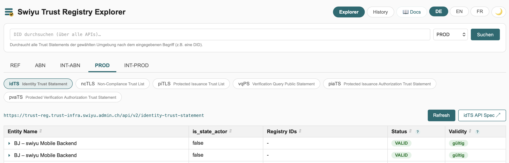

# Trust Registry Explorer

A lightweight PHP tool for browsing and searching the [swiyu](https://www.eid.admin.ch/) Trust Registry APIs across multiple environments — decodes the returned JWTs and displays their contents in readable, searchable tables.

> This project is fully developed and maintained with [Claude](https://claude.com) (Anthropic).

## Features

- **Multiple environments** — REF, ABN, PROD, INT-ABN, INT-PROD (easy to add more)
- **Six supported APIs** — `ncTLS`, `piTLS`, `vqPS`, `piaTS`, `pvaTS`, `idTS`
- **JWT decoding** (header + payload, no signature verification) with human-readable timestamps
- **Pagination and full-text search** — search automatically loads and searches across *all* pages of an API, not just the currently displayed one
- **Expandable row details** — click any row to see every field present in that entry's JWT; empty fields are explicitly marked as such, missing fields simply don't appear (so you can see at a glance which translations/attributes exist for a given entry)
- **Global DID search** — search a single DID across all six APIs at once and see every place it appears, with the entity name (from idTS) shown up front if available
- **Responsive UI** — full table on desktop, stacked card view on mobile, same underlying data and markup
- **Config-driven** — add a new environment or API by editing `config.php`, no other code changes needed
- **History tracking** — a nightly cron job records the total number of trust statements per environment/API into a local SQLite database; a chart view (`history.php`) lets you pick a time range and any combination of environment/API curves to compare, with a logarithmic/linear scale toggle. Chart.js is vendored locally (`assets/chart.umd.min.js`) — no CDN dependency, works on hosts without outbound access to third-party script CDNs
- **Dark mode** — follows the OS/browser color scheme by default; a toggle (🌙/☀️, top right on both pages) lets you override it, remembered across visits. Covers the Explorer, the History page, and the History chart's colors (axes, grid, curves)
- **Logo & favicon** — a two-color "registry stack" mark (Petrol `#0F6B72` & Gold `#D9A62B`) in the browser tab and next to the title on both pages; the same two colors drive `--accent`/`--accent-2` everywhere else in the UI (active tab, links, buttons, the first two chart curves), so the brand is consistent top to bottom
- **Loading spinner** — the logo doubles as a subtle animated indicator (bars pulse, seal pops) shown over the table/chart while a page reload is in flight, e.g. switching to an API with 1'500+ entries (vqPS)

## Screenshot



## Requirements

- PHP 8.1 or newer
- PHP extensions: `curl`, `session`, `pdo_sqlite` (only needed for the History feature)
- Outbound HTTPS access to the relevant `*.trust-infra.swiyu.admin.ch` (or `*.swiyu-int.admin.ch`) hosts
- For the History feature: the ability to schedule a cron job, and a writable `storage/` directory

## Setup

1. Copy `config.php`, `functions.php`, `index.php`, `history.php`, `collect.php`, the `assets/` folder, and the `storage/` folder (with its `.gitkeep`) into the same directory on your web server (or run locally, see below).
2. Point your web server's document root at that directory, or run it locally for a quick test:

   ```bash
   php -S localhost:8000
   ```

3. Open the page in a browser, pick an environment tab, then an API — that's it, no build step or dependencies to install.

### Enabling History tracking

The History view (`history.php`) reads from a local SQLite database that a
separate collector script fills. This is opt-in — the Explorer itself works
without it — but to see any data in the History chart:

1. Make sure `storage/` (see `history.db_path` in `config.php`) is writable
   by whichever user runs the cron job (and readable by the web server user
   for `history.php`).
2. Schedule `collect.php` to run once a night, e.g. via crontab:

   ```
   0 23 * * * php /path/to/project/collect.php
   ```

   `collect.php` is CLI-only (it refuses to run through the web server). It
   queries every configured environment × API combination for its current
   total entry count — always counting **all** statements, active and
   inactive, regardless of any filter — and stores one row per combination
   per run in `storage/history.sqlite`. A failed query is stored as an
   explicit error row (not a zero), so a bad night shows up as a gap in the
   chart rather than a misleading drop.

   The script writes its own log to `storage/collect.log` (resolved via
   `__DIR__`, not via shell redirection), so it works reliably even on
   hosting panels/schedulers whose working directory isn't the project
   folder. A `>> .../collect.log 2>&1` redirect on the cron line is
   harmless but no longer necessary.
3. After a couple of nightly runs, open `history.php`, pick a time range and
   the environment/API curves you want to compare.

## Configuration

Everything that can change — environments, APIs, their columns, and a few global settings — lives in `config.php`. No other file needs to be touched to extend the tool.

### Adding a new environment

```php
'environments' => [
    'REF' => ['label' => 'REF', 'base_url' => 'https://trust-reg-r.trust-infra.swiyu.admin.ch'],
    // add a new one the same way:
    'NEW-ENV' => ['label' => 'NEW-ENV', 'base_url' => 'https://your-new-host.example.ch'],
],
```

### Adding a new API

```php
'apis' => [
    'myAPI' => [
        'label'       => 'myAPI',
        'description' => 'What this API represents',
        'path'        => '/api/v2/my-endpoint',
        // 'single_jwt_list': the endpoint returns ONE JWT whose payload contains a list field
        // 'paginated_jwt':   the endpoint returns {"content": [JWT, ...], "page": {...}} and supports ?page=&size=
        'mode'        => 'paginated_jwt',
        'expandable'  => true, // allow clicking a row to see the full decoded entry
        'columns'     => [
            ['key' => 'sub', 'label' => 'Subject (DID)', 'type' => 'text'],
            ['key' => 'iat', 'label' => 'Issued At',     'type' => 'unix'],
            // 'text' | 'unix' | 'iso' | 'list' | 'raw_bool' | 'multilang' | 'registry_ids'
        ],
    ],
],
```

Other settings in `config.php`:

- `page_size` — how many rows are shown per page after filtering/searching
- `cache_ttl` — how long fetched data is kept in the PHP session before a new "Query" click forces a refresh

## Architecture

Three files, each with a single responsibility:

| File | Responsibility |
|---|---|
| `config.php` | Environments, APIs, paths, column definitions, cache settings, History settings — the only file most extensions require |
| `functions.php` | JWT decoding, HTTP fetching (incl. following pagination), full-text search, per-entry detail rendering, cross-API DID search, History helpers (counting, SQLite access, time-range resolution) |
| `index.php` | The UI: environment tabs, API selector, DID search bar, table/card rendering, pagination |
| `collect.php` | CLI-only nightly collector for the History feature — counts all trust statements per environment/API and stores a snapshot in SQLite |
| `history.php` | The History UI: time range picker, environment/API curve selection matrix, Chart.js line chart |
| `assets/chart.umd.min.js` | Chart.js, vendored locally so `history.php` has no external CDN dependency |
| `assets/theme.css` | Light/dark color tokens (CSS custom properties), shared by `index.php` and `history.php` — the only place to adjust a color. Also defines the `.tre-logo`/`.tre-spinner` icon styling and the `.tre-loading-overlay` component |
| `assets/theme.js` | Dark-mode logic: follows the OS setting by default, the toggle button overrides it and remembers the choice (`localStorage`), fires a `trustexplorer:themechange` event other scripts (the History chart) can react to. Also exposes `TrustExplorer.attachLoadingOverlay()`, which wires the loading spinner to a page's links/forms |
| `assets/favicon.svg`, `favicon.ico`, `favicon-*.png`, `apple-touch-icon.png` | The logo mark, rendered to the sizes browsers/OSes expect for a tab icon / bookmark / home-screen icon. Regenerate from `assets/favicon.svg` if the mark ever changes |

### Brand colors

Petrol (`#0F6B72` light / `#4FB8AE` dark) and Gold (`#D9A62B` light / `#E8B93E` dark) are the product's two colors — used in the logo, the favicon, and reused throughout the UI via `--accent`/`--accent-2` (and their `-fill`/`-soft` variants) in `assets/theme.css`. To restyle the brand, change the values there; nothing elsewhere hardcodes a color.

Fetched and decoded entries are cached per environment+API in the PHP session for `cache_ttl` seconds, so paging and searching don't repeatedly hit the upstream API. The "Query" button forces an immediate refresh.

## Limitations

- **JWT signatures are not verified.** This is a display/inspection tool, not a trust or integrity check — don't rely on it to validate authenticity.
- **Session-based cache**, not shared between users — each visitor triggers their own fetches.
- **No authentication.** Anyone with access to the deployed page can see everything it can reach; deploy accordingly (e.g. behind your own access control if needed).
- **History data is only as good as the cron job.** If `collect.php` isn't scheduled (or fails silently at the infrastructure level, e.g. PHP not found), no snapshots are recorded and the chart stays empty — check `storage/collect.log` if you configured logging as shown above.

## Feature requests & issues

Found a bug or have an idea for a new feature (e.g. another API, another column)? Please [open an issue](https://github.com/laudatioUno/trust-registry-explorer/issues) on GitHub.

## License

MIT — see [LICENSE](LICENSE).
